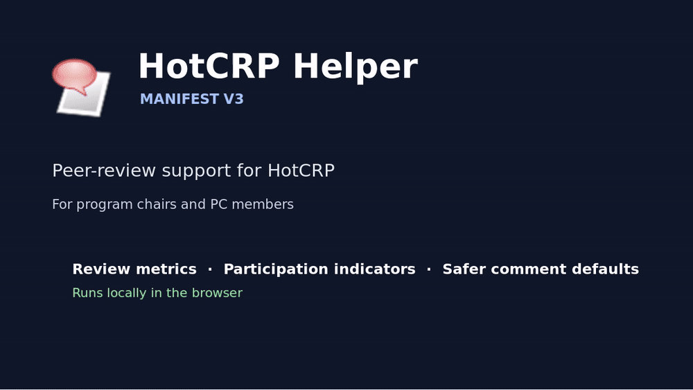

HotCRP Helper is a browser extension, compliant with Manifest V3, for Chromium-based browsers that augments the webpages referring to specific submissions (i.e., "papers") on HotCRP. It is particularly addressed to "chairs" of scientific venues whose peer-review phase is managed via HotCRP instances, but it can also support vice/area/track chairs, as well as individual PC members. 

At a high level, it adds at-a-glance review word counts, discussion statistics, per-reviewer post-rebuttal participation and last activity, one-click email links, configurable comment visibility and thread defaults, and normalized rebuttal word counts. It also provides optional rule-based R1 recommendations, as well as counters of specific keywords/symbols oftentimes associated to LLMs writing.

## Overview

The extension runs locally in the browser and is intrinsically lightweight. The code in ```content.js``` parses the rendered HotCRP page and injects derived information into it. User preferences are stored through chrome.storage.sync.

The codebase uses plain JavaScript and HTML with no build step:
* ```manifest.json``` defines supported HotCRP instances, 
*  ```popup.html``` and ```popup.js``` provide configuration, 
* ```content.js``` contains the parsing and presentation logic. 

Since HotCRP fields and markup vary across venues and releases, field identifiers may require adaptation. 

Additional instructions and descriptions on how to use the extensions are provided in the following document https://docs.google.com/presentation/d/1_Ly7ZjxoRYtMvdnjbljXEb6YxkXEAA4y/edit?usp=sharing&ouid=111520430254027932974&rtpof=true&sd=true


## Demo




## Contact and Credit

For any questions, contact giovannia@ru.is

The extension was developed by Giovanni Apruzzese (with substantial support from ChatGPT :3), and the latest version integrates suggestions/feedback received by various researchers---particularly, the USENIX Security '26 (vice) PC co-Chairs, as well as Fabio Pierazzi and Konrad Rieck. 